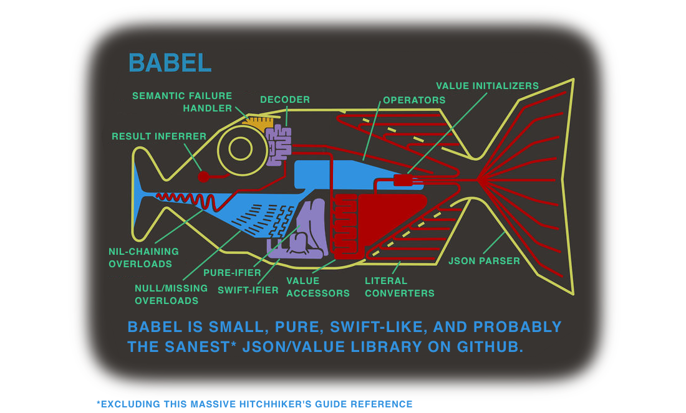

# Babel

JSON! *Pure Swift*, failure driven, inferred *but unambiguous*, with powerful *but optional* operators.

## What?

### Core

`Value` – a recursive structure to represent a Swift ~primitive value, and/or dictionaries/arrays of those values.

`JSON` – initialise a `Value` with JSON data (String, or byte array).

`Decoding` – simply navigate a `Value` tree, and expect certain types (or castable/convertible ones) along the way, with explicit/throwing failure cases.

### Optional

`Decodable` – a convenient protocol to describe types that can be decoded from a `Value`; `Decodable` extensions for Swift ~primitives; extensions to decode Arrays/Dictionaries of `Value`s to those of `Decodable`s.

`Operators` – unambiguous operators for taking concise advantage of the power of `Decoding` and `Decodable`.

`Foundation` – `Decodable` extensions for common Foundation types; initialise a `Value` with JSON in the form of NSData; non-pure-Swift/depends on Foundation ;).

`Helpers` – just some stuff handy for debugging or playing around in the Playground.

## Why (don't we already have 42 of these things)?

Dealing with JSON or other stringly typed data in a nice safe strictly typed language is one of those oh so tedious, but even more common tasks, that it's worth experimenting with until it feels right. I've tried many of the other solutions out there, loved some, hated others, and figured it would be worth trying to gather the traits of the ones I loved into one place. Typical, no?

That said, I believe Babel can excel beyond a sum of its mostly stolen parts. The main goal was/is to come up with a solution that allows for decoding stringly typed data *while actually respecting the semantics of that data's model*. Sometimes a missing value is okay, sometimes it's not, sometimes a `null` is okay, sometimes it's not. Sometimes you have a decimal, but it's actually stored/passed as a string. Sometimes you need all of an array decoded, sometimes it's okay to ignore the items that fail to decode. These kinds of things should be described simply and declaratively, so we can get back to the good coding.. whatever that is.

## Finally, an example

First of all, please play around with `Xcode/Babel.playground` (where this is cut from) after this. There's only so much that can be conveyed in markup with a type inferred language.. darn you Swift, you beautiful pseudo-code looking you!

```swift
import Babel

let jsonString = "<JSON HERE, SEE PLAYGROUND>"

let jsonData = jsonString.dataUsingEncoding(NSUTF8StringEncoding)!

let value: Value

switch dataExample {
case .String: value = try! Value(JSON: jsonString)
case .Data: value = try! Value(JSON: jsonData)
case .LiteralConvertible:
    value = [
        "apiVersion": "2.0",
        "data": [
            "items": [
                [
                    "title": "Google Developers Day US - Maps API Introduction",
                    "content": [
                        "5": "http://www.youtube.com/v/hYB0mn5zh2c?f...",
                        "6": "rtsp://v1.cache1.c.youtube.com/CiILENy.../0/0/0/video.3gp",
                        "1": "rtsp://v5.cache3.c.youtube.com/CiILENy.../0/0/0/video.3gp"
                    ],
                    "favoriteCount": 201,
                    "rating": 4.63,
                    "uploaded": "2007-06-05T22:07:03.000Z"
                ],
                ....
            ],
            "totalItems": 800
        ]
    ]
}
```
##### Each of the decoding examples below is semantically equivalent (navigates/parses/succeeds/fails in the same way for the given data model). Which do you prefer (it's okay to not like custom operators ;) )?

```swift
do {
    let content: [Int: NSURL]?
    
    switch decodingExample {
    case .Operators:
        content = try value =>? "data" => "items" =>?? 0 => "content"
        
    case .FunctionInferred:
        content = try value.maybeValueFor("data")?.valueFor("items")
                           .maybeValueAt(0, throwOnMissing: false)?.valueFor("content").decode()
        
    case .FunctionExplicit:
        content = try value.asDictionary()
                           .maybeValueFor("data", nilOnNull: true, throwOnMissing: true)?.asDictionary()
                           .valueFor("items").asArray()
                           .maybeValueAt(0, nilOnNull: true, throwOnMissing: false)?.asDictionary()
                           .valueFor("content").asDictionary()
                           .decode(keyType: Int.self, valueType: NSURL.self, ignoreFailures: false)
        
    case .UnwrappingAndChecking:
        var decodedContent: [Int: NSURL]?
        
        if let valueDictionary = value.dictionaryValue {
            if let data = valueDictionary["data"] {
                if data.isNull {
                    decodedContent = nil
                } else if let dataDictionary = data.dictionaryValue {
                    if let items = dataDictionary["items"] {
                        if let itemsArray = items.arrayValue {
                            if itemsArray.count > 0 && itemsArray[0].isDictionary {
                                let itemDictionary = itemsArray[0].dictionaryValue!

                                if let content = itemDictionary["content"] {
                                    if let contentDictionary = content.dictionaryValue {
                                        decodedContent = [:]
                                        
                                        for (key, value) in contentDictionary {
                                            if let key = Int(key) {
                                                if let string = value.stringValue, url = NSURL(string: string) {
                                                    decodedContent![key] = url
                                                } else { throw DecodingError.TypeMismatch(expectedType: NSURL.self, value: value) }
                                            } else { throw DecodingError.TypeMismatch(expectedType: Int.self, value: .String(key)) }
                                        }
                                    } else { throw DecodingError.TypeMismatch(expectedType: Dictionary<String, Value>.self, value: content) }
                                } else { throw DecodingError.MissingKey(key: "content", dictionary: itemDictionary) }
                            } else { decodedContent = nil }
                        } else { throw DecodingError.TypeMismatch(expectedType: Array<Value>.self, value: items) }
                    } else { throw DecodingError.MissingKey(key: "items", dictionary: dataDictionary) }
                } else { throw DecodingError.TypeMismatch(expectedType: Dictionary<String, Value>.self, value: data) }
            } else { throw DecodingError.MissingKey(key: "data", dictionary: valueDictionary) }
        } else { throw DecodingError.TypeMismatch(expectedType: Dictionary<String, Value>.self, value: value) }

        content = decodedContent
    }
    
    prettyPrint("Nested content: ", content)
} catch let error { prettyPrint("Nested content error: ", error) }

```
